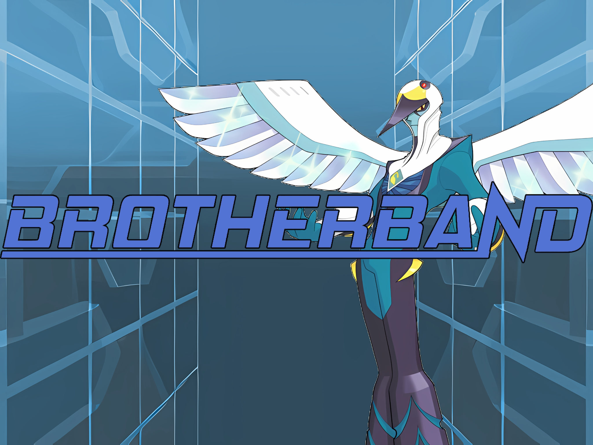

# BrotherBand-Cygnus-

A Go version of the BrotherBand protocol made using SOLID, tests and Clean Architecture, Clean Coding and (some) OOP. Lighter. Faster. Swifter.



> Backend HTTP API for **BrotherBand** — a minimalist social network built around small,
> trusted "brotherband" circles instead of feeds, followers, and engagement metrics.
>
> *Cygnus* is the third iteration of the project. It supersedes *Hollow* (the previous
> TypeScript / Fastify / MongoDB build) with a Go / Chi / Postgres / R2 stack designed
> against strict **Clean Architecture**, **Clean Code**, and **SOLID** principles, with
> comprehensive structured logging, a uniform error model, and a four-layer test strategy.

This README is the single, exhaustive reference for the project: what it is, why it
exists, how every layer and package is organised, how a request flows end to end, the
data model, the auth/media/error/logging models, how to build/run/test it, and every
deliberate design trade-off.

---

## Table of contents

1. [The product](#1-the-product)
2. [Tech stack](#2-tech-stack)
3. [Architecture: Clean layers & the Dependency Rule](#3-architecture-clean-layers--the-dependency-rule)
4. [Directory layout](#4-directory-layout)
5. [Package-by-package reference](#5-package-by-package-reference)
6. [Request lifecycle (end to end)](#6-request-lifecycle-end-to-end)
7. [Domain model & invariants](#7-domain-model--invariants)
8. [Data model & schema](#8-data-model--schema)
9. [Authentication & session model](#9-authentication--session-model)
10. [Media upload model](#10-media-upload-model)
11. [Error model](#11-error-model)
12. [Logging & observability](#12-logging--observability)
13. [Configuration](#13-configuration)
14. [Build, run & local development](#14-build-run--local-development)
15. [API surface](#15-api-surface)
16. [Testing strategy](#16-testing-strategy)
17. [Design decisions & trade-offs](#17-design-decisions--trade-offs)
18. [Known gaps / deferred](#18-known-gaps--deferred)
19. [Project conventions](#19-project-conventions)
20. [License](#20-license)

---

## 1. The product

### Vision & mission

BrotherBand exists to create a **healthier digital social experience** centered on
intimacy, trust, and meaningful human connection — instead of attention, popularity,
and endless engagement. It is a deliberately minimal platform where people maintain a
small circle of trusted relationships, free from feeds, metrics, toxicity, and social
pressure.

### What makes it different

- **No infinite feed.** There is no algorithmic timeline.
- **No followers / no public popularity metrics.**
- **A strictly limited social circle.** Relationships are explicit, mutual, and few.
- **Intimacy over growth.** The product is designed around emotional safety and
  intentional interaction, not reach.

### The core mechanic: the *brotherband*

The relationship primitive is the **brotherband** — a mutual, trusted bond between
exactly two users. The lifecycle:

1. User A sends a **brotherband request** to User B.
2. User B **accepts** (or **denies**) it.
3. On acceptance, B is shown A's **secret** — a personal phrase A wrote at
   registration — **exactly once**. This one-shot reveal is the trust ritual at the
   heart of the product: the secret is never returned again by any endpoint.
4. A and B are now **brothers** and can message each other.
5. Either side may **cut** the brotherband at any time (symmetric unfriend).

Every user also has a short free-form **status**, and lists exactly **five favourites**
at registration — the cardinality is a product signal ("a small circle"), enforced as a
domain invariant, not merely a UI hint.

### Target users (and non-users)

Built for the emotionally-exhausted social-media user, the small-circle
relationship-oriented user, the mental-health-conscious user, and the
privacy/minimalism-oriented user. **Explicitly not** for influencers, creators, brands,
audience-growth seekers, advertisers, or high-frequency content consumers.

---

## 2. Tech stack

| Concern          | Choice                                                                  |
|------------------|-------------------------------------------------------------------------|
| Language         | Go 1.21+ (developed/verified on Go 1.26)                                 |
| HTTP router      | `net/http` + [chi v5](https://github.com/go-chi/chi)                     |
| Persistence      | PostgreSQL 16 via [`pgx/v5`](https://github.com/jackc/pgx) (sqlc-compatible spec) |
| Object storage   | Cloudflare R2 (S3-compatible) via `aws-sdk-go-v2`                        |
| Auth             | Stateless 30-day JWT (HS256, `golang-jwt/v5`) in an httpOnly cookie + double-submit CSRF |
| Password hashing | argon2id (`golang.org/x/crypto/argon2`, OWASP-2024 params)              |
| Migrations       | [goose v3](https://github.com/pressly/goose), embedded, advisory-locked  |
| Observability    | `log/slog` (JSON) + Prometheus (`client_golang`) + request IDs           |
| API contract     | [`api/openapi.yaml`](api/openapi.yaml) — OpenAPI 3.1, source of truth    |
| Testing          | stdlib `testing` + `httptest` + Testcontainers (layer-2, Docker-gated)   |

No ORM. No DI framework. No code generation is required to build (the sqlc spec is
committed but the repositories are hand-written `pgx` — see §17).

---

## 3. Architecture: Clean layers & the Dependency Rule

The codebase is organised into four concentric layers. **Source-code dependencies point
inward only.** This is enforced mechanically (a `grep` audit is part of the verification
sweep) — not merely by convention.

```
        ┌─────────────────────────────────────────────┐
        │  infrastructure/   (frameworks & drivers)    │
        │  ┌───────────────────────────────────────┐   │
        │  │  adapter/   (interface adapters)       │   │
        │  │  ┌─────────────────────────────────┐   │   │
        │  │  │  usecase/   (application layer)  │   │   │
        │  │  │  ┌───────────────────────────┐  │   │   │
        │  │  │  │  domain/  (enterprise)    │  │   │   │
        │  │  │  │  pure Go · zero deps      │  │   │   │
        │  │  │  └───────────────────────────┘  │   │   │
        │  │  └─────────────────────────────────┘   │   │
        │  └───────────────────────────────────────┘   │
        └─────────────────────────────────────────────┘
              cmd/api/main.go  ── the composition root
              (the only file that imports every layer)
```

**The Dependency Rule, concretely:**

| Layer              | May import                                  | May **not** import                          |
|--------------------|---------------------------------------------|---------------------------------------------|
| `domain/`          | stdlib, `google/uuid` only                  | anything else in this module; any framework |
| `usecase/`         | `domain/`, `usecase/port/`                  | `adapter/`, `infrastructure/`               |
| `adapter/`         | `usecase/`, `domain/`, `platform/`          | `infrastructure/` (except wiring types)     |
| `infrastructure/`  | anything (it is the outermost wiring)       | —                                           |
| `cmd/api/main.go`  | everything (composition root)               | —                                           |

**Why this matters:** the business rules (`domain/`) and the application logic
(`usecase/`) have **no knowledge of HTTP, Postgres, R2, JWT, or chi**. You could replace
Chi with another router, Postgres with another store, or R2 with S3, and the inner two
layers would not change a line. Dependency Inversion is applied via **ports**:
the inner layer declares an interface; the outer layer implements it.

The split between **adapter** and **infrastructure** is precise:

- If a type **implements an inner interface** (a domain repository, a `usecase/port`),
  it is an **adapter** — e.g. the Postgres repositories, the argon2id hasher, the JWT
  issuer, the R2 presigner.
- If it is **pure technical wiring that implements nothing inward-facing** — the pgx
  pool factory, the goose runner, the AWS SDK client, the slog handler factory, the
  Prometheus registry — it is **infrastructure**.

---

## 4. Directory layout

```
.
├── api/
│   └── openapi.yaml                  # OpenAPI 3.1 — the API contract & source of truth
├── cmd/
│   └── api/
│       └── main.go                   # composition root: load config → wire graph → serve
├── internal/
│   ├── domain/                       # ── LAYER 1: enterprise rules (pure Go, zero deps)
│   │   ├── shared/                   #    ID value type, base error sentinels, ValidationError
│   │   ├── user/                     #    User aggregate + value objects + repo ports + errors
│   │   ├── brotherband/              #    Request + Brotherhood aggregates + ports + errors
│   │   ├── message/                  #    Message/Conversation/Attachment/Cursor + ports + errors
│   │   └── media/                    #    ImageStore port + content-type/size rules + errors
│   ├── usecase/                      # ── LAYER 2: application logic (one struct per operation)
│   │   ├── port/                     #    cross-cutting ports: Clock, PasswordHasher,
│   │   │                             #      TokenIssuer, CSRFMinter, AvatarURLResolver
│   │   ├── user/                     #    Register, Login, GetProfile, UpdateStatus, UpdateAvatar
│   │   ├── brotherband/              #    Send/Accept/Deny/Cut, ListRequests/Brothers, GetBrother
│   │   ├── message/                  #    SendMessage, ListMessages, AttachMedia, ListConversations
│   │   └── media/                    #    RequestUpload
│   ├── adapter/                      # ── LAYER 3: interface adapters
│   │   ├── http/                     #    inbound (driving) adapter
│   │   │   ├── server.go             #      http.Server lifecycle + timeouts
│   │   │   ├── router.go             #      chi route table + middleware order (only this file knows paths)
│   │   │   ├── handler/              #      one thin struct per resource (request→usecase→response)
│   │   │   ├── dto/                  #      HTTP-shaped JSON DTOs + use-case↔wire converters
│   │   │   ├── middleware/           #      Recover, RequestID, Logger, AccessLog, Metrics,
│   │   │   │                         #        CORS, CSRF, Auth, RateLimit, shared error writer
│   │   │   └── respond/              #      canonical JSON/error responder + cookie writer
│   │   ├── persistence/
│   │   │   └── postgres/             #      repository implementations + DBTX + sqlc spec
│   │   ├── auth/                     #      argon2id hasher, JWT issuer, CSRF minter
│   │   └── storage/
│   │       └── r2/                   #      Cloudflare R2 presigner (implements media.ImageStore)
│   ├── infrastructure/               # ── LAYER 4: frameworks & drivers (pure wiring)
│   │   ├── config/                   #    env loading + validation (fail-fast at boot)
│   │   ├── postgres/                 #    pgx pool factory + embedded goose migrations
│   │   ├── s3/                       #    aws-sdk-go-v2 client targeted at R2
│   │   └── observability/            #    slog JSON handler factory + Prometheus registry
│   ├── platform/                     # ── cross-cutting non-business helpers
│   │   ├── clock/                    #    SystemClock + Fixed (implements usecase/port.Clock)
│   │   └── logging/                  #    context-bound logger, attr keys, test Capture handler
│   └── test/                         # ── test helpers (not importable outside the module)
│       ├── fixtures/                 #    builder-pattern entity fixtures
│       ├── fakes/                    #    hand-rolled in-memory port doubles + Failing* doubles
│       └── containers/               #    Testcontainers session helpers (layer-2)
├── scripts/
│   ├── dev-up.sh                     # start/stop local Postgres + MinIO
│   └── docker-compose.dev.yml
├── docs/                             # business / technical / architecture source documents
├── Makefile                          # build, run, test, lint, sqlc, migrate, dev-up targets
├── .env.example                      # every environment variable, documented
├── go.mod / go.sum
└── README.md                         # this document
```

---

## 5. Package-by-package reference

### `internal/domain/` — enterprise rules

Pure Go. Imports only the standard library and `google/uuid`. No frameworks, no I/O,
no `time.Now()` (time is injected). Every aggregate owns its entity, value objects,
repository **interfaces** (ports), and error sentinels in one package (SRP at the
package level; aggregates never import each other, so import cycles cannot form).

| Package              | Responsibility |
|----------------------|----------------|
| `domain/shared`      | The `ID` value type (UUID wrapper with JSON marshalling), base error sentinels (`ErrNotFound`, `ErrConflict`, `ErrForbidden`, `ErrInvalidInput`, `ErrUnauthenticated`), and the typed `ValidationError` / `ValidationErrors` carrying `Field`+`Reason`. |
| `domain/user`        | `User` aggregate; value objects `Username`, `PasswordHash`, `Birthdate`, `Secret`, `Status`, `Favorites` (each validates its own invariant and returns a typed `ValidationError`); `Reader`/`Writer`/`StatusUpdater`/`AvatarUpdater` ports split per ISP; user error sentinels. |
| `domain/brotherband` | `Request` and `Brotherhood` aggregates; the brotherhood is **symmetric** and order-independent (`Includes`/`Other`); `RequestRepository`/`BrotherhoodRepository` ports + read models; sentinels (`ErrSelfRequest`, `ErrAlreadyBrothers`, `ErrRequestExists`, `ErrNotABrother`, `ErrNotRecipient`, …). |
| `domain/message`     | `Message`, `Conversation`, `Attachment` aggregates; `Body` value object; the opaque pagination `Cursor` (base64-encoded `(created_at, id)` keyset); `MessageReader`/`MessageWriter`/`ConversationRepository` ports; sentinels. |
| `domain/media`       | The `ImageStore` port; the closed set of allowed content types; `MaxUploadBytes`; `ParseContentType` / `ValidateContentLength` (typed validation errors); media sentinels. |

### `internal/usecase/` — application logic

**One struct per use case**, each with a single `Execute(ctx, Input) (Output, error)`
method (SRP-maximal; the mock surface stays minimal). Each use case has its own
Input/Output DTOs (`dto.go`) so domain types never leak to handlers and HTTP types
never enter use cases. Use cases depend only on `domain/` and `usecase/port/`.

- `usecase/port` — the cross-cutting interfaces the application layer needs the outside
  world to satisfy: `Clock`, `PasswordHasher`, `TokenIssuer`, `CSRFMinter`,
  `AvatarURLResolver`. Dependency Inversion made explicit: inner layer declares,
  outer layer implements.
- `usecase/user` — `RegisterUser`, `LoginUser`, `GetProfile`, `UpdateStatus`, `UpdateAvatar`.
- `usecase/brotherband` — `SendRequest`, `AcceptRequest`, `DenyRequest`,
  `CutBrotherband`, `ListRequests`, `ListBrothers`, `GetBrother`.
- `usecase/message` — `SendMessage`, `ListMessages`, `AttachMedia`, `ListConversations`.
- `usecase/media` — `RequestUpload`.

Every `Execute` checks `ctx.Err()` first (fail fast on cancellation), validates input
at the value-object boundary, performs the operation through narrow ports, and emits
structured logs at the appropriate level (see §12).

### `internal/adapter/` — interface adapters

- `adapter/http/handler` — one thin struct per resource. A handler decodes the request
  into an HTTP DTO, converts to a use-case Input, calls the use case, converts the
  Output to an HTTP DTO, and writes it. **No business logic.** `decode.go` is the
  hardened JSON decoder (size cap, unknown-field rejection, trailing-data rejection,
  every `encoding/json` error family mapped to a typed field error).
- `adapter/http/dto` — JSON request/response structs and the `*FromUseCase` /
  `*ToUseCase` converters. Two adapters, two shapes: JSON tags and snake/camel naming
  never bleed into use cases.
- `adapter/http/middleware` — the chi-compatible wrappers (see §6 for order) plus
  `error_writer.go`, the **single** place middleware emits a JSON error envelope
  (one helper, JSON-encoded, request-id aware — eliminates per-middleware string
  literals).
- `adapter/http/respond` — `respond.Error` (the canonical domain-error → HTTP mapper,
  `respond.JSON`, `respond.NoContent`) and the cookie writer (`WriteSession` /
  `ClearSession`). Kept in its own package so the router (which imports `handler/`)
  and the handlers (which call `respond`) don't form an import cycle.
- `adapter/persistence/postgres` — repository implementations over a minimal `DBTX`
  interface satisfied by both `*pgxpool.Pool` and `pgx.Tx` (this is what makes the
  transaction-per-test strategy possible); `errmap.go` translates SQLSTATE codes to
  domain sentinels; `query/*.sql` + `sqlc.yaml` are the committed sqlc spec.
- `adapter/auth` — `Argon2idHasher` (implements `port.PasswordHasher`), `JWTIssuer`
  (implements `port.TokenIssuer`), `RandomCSRFMinter` (implements `port.CSRFMinter`).
- `adapter/storage/r2` — the `Presigner` implementing `domain/media.ImageStore`
  against Cloudflare R2.

### `internal/infrastructure/` — frameworks & drivers

- `infrastructure/config` — env loading with up-front validation; boot **fails fast**
  with a structured error listing every missing/invalid variable.
- `infrastructure/postgres` — the pgx pool factory (tuned limits) and the embedded,
  advisory-locked goose migration runner.
- `infrastructure/s3` — the aws-sdk-go-v2 client configured for R2 (custom endpoint,
  `region: auto`, checksum behaviour pinned for R2 compatibility).
- `infrastructure/observability` — the slog JSON handler factory and the Prometheus
  registry + collectors.

### `internal/platform/` & `internal/test/`

- `platform/clock` — `System` (UTC, real time) and `Fixed` (deterministic, for tests),
  both implementing `usecase/port.Clock`. **No business code ever calls `time.Now()`.**
- `platform/logging` — the context-bound logger seam (`WithLogger`/`FromContext`/
  `FromContextOr`), canonical attribute keys, and the goroutine-safe `Capture` slog
  handler used to assert on log output in tests.
- `test/fixtures` — builder-pattern entity fixtures (absorb constructor changes so
  tests don't all break when a constructor gains a parameter).
- `test/fakes` — hand-rolled in-memory port doubles (state assertion) **and** the
  `Failing*` doubles + `StaticHasher` (for exercising the unexpected-infra-failure
  path).
- `test/containers` — Testcontainers session helpers for the Docker-gated repository
  layer.

---

## 6. Request lifecycle (end to end)

A request to an authenticated, state-changing endpoint
(`PATCH /v1/me/status`) traverses, in order:

```
client
  │  POST/PATCH with bb_session cookie + bb_csrf cookie + X-CSRF-Token header
  ▼
┌──────────────────────────────────────────────────────────────────────────┐
│ chi router (internal/adapter/http/router.go)                              │
│                                                                            │
│  1. Recover      → any downstream panic becomes a structured 500 + ERROR   │
│                     log + requestId (the load-bearing safety net)          │
│  2. RequestID    → reads/generates X-Request-ID, puts it in ctx + response │
│  3. Logger       → binds a request-id-tagged *slog.Logger into ctx         │
│  4. AccessLog    → (defers) one structured line; level tracks status       │
│  5. Metrics      → (defers) Prometheus counter + duration by chi route     │
│  6. CORS         → allow-list echo; OPTIONS preflight short-circuits 204   │
│  7. Auth         → verifies bb_session JWT → user ID into ctx;             │
│                     enriches the ctx logger with user_id; 401 on failure   │
│  8. CSRF         → constant-time double-submit compare; 403 on mismatch    │
│  ▼                                                                         │
│  handler  → decodeJSON (size-capped, strict) → use-case Input              │
│  ▼                                                                         │
│  use case → ctx.Err() guard → validate value objects → narrow ports        │
│  ▼                                                                         │
│  adapter  → Postgres repo / R2 presigner / argon2 / JWT                    │
│  ▼                                                                         │
│  use case → returns Output (or a typed/wrapped error)                      │
│  ▼                                                                         │
│  handler  → Output → HTTP DTO → respond.JSON / respond.NoContent           │
│             (or respond.Error → classify → status+code+requestId+details)  │
└──────────────────────────────────────────────────────────────────────────┘
  │  every response carries X-Request-ID; errors carry requestId in the body
  ▼
client
```

Anonymous endpoints (`/healthz`, `/readyz`, `/metrics`, `/v1/auth/*`) mount only the
first six middleware — see §9 for why `/v1/auth/*` is intentionally exempt from CSRF.

---

## 7. Domain model & invariants

Construction of every entity goes through a validating constructor (`New…`) or an
adapter-only `Rehydrate…` (no validation — invariants were enforced at write time).
Entities are immutable; mutations return a copy (`WithStatus`, `WithAvatarKey`,
`WithAttachments`).

**Value-object invariants (enforced in `domain/`, returning typed `ValidationError`):**

| Value object | Invariant |
|--------------|-----------|
| `Username`   | 3–32 chars; letters/digits/`_`/`-` only; trimmed; case-preserving (CITEXT at DB) |
| Password     | 8–128 chars (`ValidateRawPassword`; the raw password never enters domain state) |
| `Birthdate`  | parseable `YYYY-MM-DD` calendar date |
| `Secret`     | 1–280 chars after trimming |
| `Status`     | 1–280 chars after trimming |
| `Favorites`  | **exactly 5** non-empty entries, each ≤ 80 chars (the "small circle" product invariant) |
| `Body`       | 1–4000 chars after trimming |
| `Attachment` | non-empty media key + content type, positive size |

**Aggregate invariants:**

- `Request`: requester ≠ recipient (`ErrSelfRequest`); uniqueness on
  `(requester, recipient)` enforced at the DB and translated to `ErrRequestExists`.
- `Brotherhood`: symmetric and order-independent. `Includes(id)` / `Other(id)` make
  membership queries position-agnostic; the persistent form is canonicalised (see §8).
- `AcceptRequest`: only the **recipient** may accept (`ErrNotRecipient`); the
  requester's secret is returned **exactly once** and the request row is deleted in
  the same operation — there is no code path that can return the secret again.

---

## 8. Data model & schema

Single datastore: PostgreSQL. Messages live in Postgres with everything else (one
transaction boundary, one connection pool, one backup story). Migrations are embedded
and run at boot under a goose advisory lock (safe with concurrent replicas).

```
users(id, username CITEXT UNIQUE, password_hash, birthdate, secret,
      status, favorites TEXT[]  CHECK(cardinality=5), avatar_key?, registered_at)

brotherband_requests(id, requester_id→users, recipient_id→users, created_at)
      CHECK(requester ≠ recipient)  UNIQUE(requester_id, recipient_id)

brotherhoods(user_low_id→users, user_high_id→users, became_brothers_at)
      PK(user_low_id, user_high_id)  CHECK(user_low_id < user_high_id)
      ── the symmetric bond stored as ONE canonical row per pair

conversations(id, created_at)
conversation_participants(conversation_id→conversations, user_id→users,
      joined_at, last_read_at?)  PK(conversation_id, user_id)

messages(id, conversation_id→conversations, sender_id→users, body,
      metadata JSONB, created_at, edited_at?)
      INDEX(conversation_id, created_at DESC, id DESC)  ── keyset pagination

message_attachments(id, message_id→messages, media_key, content_type,
      size_bytes CHECK(>0), created_at)
```

**Key design points:**

- **Canonical brotherhood row.** Because the relationship is symmetric, it is stored
  as a single row per pair ordered `user_low_id < user_high_id`. One source of truth,
  one row to delete on cut, no "which direction" ambiguity. The repository
  canonicalises with `LEAST/GREATEST` on every operation; domain code stays
  order-agnostic.
- **Cursor pagination.** `messages` is indexed on `(conversation_id, created_at DESC,
  id DESC)`, making the keyset predicate an index-only range scan. Offset pagination
  is intentionally avoided (it degrades to O(offset) and breaks under concurrent
  inserts). The cursor is an **opaque** base64 token; clients must not parse it.
- **Conversations are N-participant in the schema** even though Cygnus only creates
  1:1 ones — a future group feature needs no migration.

---

## 9. Authentication & session model

**A single stateless JWT, 30-day expiry, HS256-signed, in an httpOnly + Secure +
SameSite=Lax cookie. No refresh rotation. No DB-backed session store.**

| Cookie       | HttpOnly | Purpose |
|--------------|----------|---------|
| `bb_session` | **yes**  | the JWT (`sub`=user id). JS cannot read it; XSS cannot steal it. |
| `bb_csrf`    | no       | 32 random bytes; the SPA reads it and echoes it as `X-CSRF-Token`. |

**CSRF — double-submit token.** State-changing **authenticated** requests must send a
`X-CSRF-Token` header equal to the `bb_csrf` cookie; the middleware does a
constant-time compare. An attacker on another origin cannot read `bb_csrf` (CORS
forbids it) and cannot forge the header. `SameSite=Lax` is the first line of defence;
the double-submit token is defence in depth.

**The `/v1/auth/*` CSRF exemption (deliberate, documented).** `register`, `login`, and
`logout` are **not** behind the CSRF check. The check requires the client to echo
`bb_csrf`, but register/login are the endpoints that *issue* that cookie — gating them
on it is an impossible bootstrap. Cross-site POSTs to them are already blocked by the
`SameSite=Lax` session cookie and the strict CORS allow-list; the double-submit token
then guards every authenticated state-changing request. Logout is a low-severity
annoyance if forced and is likewise `SameSite`-protected. This is reflected in
`api/openapi.yaml` (`security: []` on all three).

**Password hashing — argon2id**, OWASP-2024 "interactive" params (`m=19 MiB, t=2,
p=1`), salt + params embedded in the encoded string (no separate salt column).
Verification is constant-time; a malformed *stored* hash is collapsed to
`ErrInvalidCredentials` (never disclosed to the client) but logged as a
data-integrity alarm.

**Trade-off (accepted):** a leaked `bb_session` is valid until natural 30-day expiry;
password change does not invalidate existing tokens. Upgrade path: a `token_version`
column compared on each request. Deferred — see §18.

---

## 10. Media upload model

Images never pass through the API server. The flow:

```
1. client → POST /v1/media/upload-url   (validate auth + MIME + size; rate-limited)
            ← { uploadUrl (presigned PUT, 15-min, size+type bound), mediaKey, expiresAt }
2. client → PUT {uploadUrl}  →  Cloudflare R2 directly
            (R2 rejects mismatched Content-Type / Content-Length at the edge)
3. client → PATCH /v1/me/avatar  or  /v1/messages/{id}/attachment  { mediaKey }
            (server promotes the object out of pending/ and records it)
```

- Allowed types: `image/jpeg`, `image/png`, `image/webp`. Hard cap **10 MiB**, signed
  into the URL.
- Keys: `pending/{userId}/{uuid}{ext}` → promoted to
  `avatars/{userId}/…` or `messages/{convId}/{msgId}/…`. Anything left under
  `pending/` for 24 h is swept by an R2 lifecycle rule.
- **Ownership is enforced**: a media key must live under the *caller's* `pending/`
  prefix, or promotion is refused (`ErrPromotionFailed`) and logged at WARN — this is
  the "broken access control" guard.
- The presign endpoint is rate-limited by an in-process token bucket
  (20 req/min, burst 5, global — see §18).

---

## 11. Error model

Every error is **typed, wrapped with context, mapped to a stable HTTP code, tagged
with the request id, and logged at the right level.** There is no `panic` in any
request path.

### The taxonomy

- **Base sentinels** (`domain/shared`): `ErrNotFound`, `ErrConflict`, `ErrForbidden`,
  `ErrInvalidInput`, `ErrUnauthenticated`. Aggregate errors wrap these so the HTTP
  mapper can fall back by category.
- **Aggregate sentinels** (e.g. `user.ErrUsernameAlreadyTaken`,
  `brotherband.ErrNotRecipient`, `message.ErrNotParticipant`) — each
  `fmt.Errorf("…: %w", shared.Err…)`.
- **`ValidationError{Field, Reason, Sentinel}`** — returned by every value-object
  constructor. It multi-unwraps so `errors.Is` matches **both** the specific sentinel
  (e.g. `user.ErrPasswordTooWeak`) **and** the broad `shared.ErrInvalidInput`. It
  carries the offending field + human reason for the API response.
- **`ValidationErrors`** — aggregates multiple field failures.

### The wire envelope

`respond.Error` is the single domain-error → HTTP translator. `classify()` is a
deliberately **exhaustive** switch (one case per sentinel, specific before category).
The response body:

```json
{
  "code": "user.password_too_weak",      // stable, machine-readable; switch on this
  "message": "invalid password: must be between 8 and 128 characters",
  "requestId": "0192e…",                 // correlate with server logs & bug reports
  "details": { "field": "password", "reason": "must be between 8 and 128 characters" }
}
```

`code` is the contract (the full registry is in `api/openapi.yaml`). Unknown errors
collapse to `500 internal_error` (logged at ERROR with the original message; the
client never sees internals). The middleware error responses (401/403/429/500) go
through one shared `writeError` helper — JSON-encoded, request-id aware, defined
exactly once — and an `envelope_parity_test` guards that the middleware and
`respond` envelopes can never silently diverge.

### Error-handling guarantees, by aspect

- **Decoding**: 1 MiB body cap; unknown fields, trailing data, truncated/malformed
  JSON, and type mismatches each become a typed field error (→ 422 with `details`).
- **Repositories**: SQLSTATE → domain sentinel (unique violation →
  `ErrUsernameAlreadyTaken` / `ErrRequestExists`; `no rows` → the aggregate's
  not-found); everything else wrapped with `fmt.Errorf("postgres: …: %w", err)`.
- **Context cancellation**: every use case checks `ctx.Err()` before work.
- **Panic safety**: the `Recover` middleware, the HTTP server goroutine, and `run()`
  each have their own recover; a panic anywhere becomes a clean 500 / clean exit.
- **Boot**: invalid config fails fast with a structured ERROR log listing every
  problem and exit code 1.
- The only intentionally-ignored errors are the idiomatic response-flush
  `_, _ = w.Write(...)` (the client is already gone) and one documented
  `json.Marshal` of two statically-known fields.

---

## 12. Logging & observability

### Structured logging (`log/slog`, JSON)

A `*slog.Logger` is bound into the request context by the `Logger` middleware,
pre-tagged with `request_id`, then enriched with `user_id` by `Auth`. Every layer
calls `logging.FromContext(ctx)` and gets a logger that already carries the
correlation fields — no logger argument is threaded through signatures.

**Level discipline** (consistent across the codebase):

| Level   | Used for |
|---------|----------|
| `DEBUG` | high-volume / low-signal (validation rejections, auth cookie probes) |
| `INFO`  | successful business outcomes (`user registered`, `message sent`, …) and meaningful product rejections (`login failed: bad password` with cause) |
| `WARN`  | expected-but-notable (username taken, broken-access-control attempts, readiness blips, R2 orphan self-heals) |
| `ERROR` | unexpected infrastructure failures, panics, 5xx |

Attribute keys are centralised in `platform/logging/attrs.go` (one constant per key —
no `userID` vs `user_id` drift). The access log's level tracks the response status
(2xx INFO, 4xx WARN, 5xx ERROR). The same `request_id` appears in the
`X-Request-ID` response header, the error body's `requestId`, and every server log
line for that request — one id correlates a client failure to the exact server trace.

Logging itself is unit-tested: the `Capture` slog handler records structured records
(clone-safe across `logger.With(...)`), and tests assert that specific events log at
specific levels with specific attributes.

### Metrics — Prometheus

`GET /metrics` exposes Go runtime + process collectors plus
`http_requests_total{method,route,status}` and
`http_request_duration_seconds{method,route}`. The `route` label is the **chi route
pattern**, not the concrete URL, so path parameters don't explode cardinality.

### Health

- `GET /healthz` — liveness; 200 if the process is up.
- `GET /readyz` — readiness; pings Postgres with a 1.5 s timeout, 200 or 503.

---

## 13. Configuration

All configuration is environment-driven and validated at boot (`internal/infrastructure/config`).
Copy `.env.example` to `.env`; the defaults work against the local docker-compose stack.

| Variable               | Required | Default                         | Purpose |
|------------------------|----------|---------------------------------|---------|
| `APP_ENV`              | no       | `development`                   | `development` \| `staging` \| `production` (controls `Secure` cookies) |
| `LOG_LEVEL`            | no       | `info`                          | `debug` \| `info` \| `warn` \| `error` |
| `HTTP_ADDR`            | no       | `:8080`                         | listen address |
| `HTTP_ALLOWED_ORIGINS` | no       | `http://localhost:5173`         | comma-separated CORS allow-list |
| `HTTP_COOKIE_DOMAIN`   | no       | (empty)                         | cookie `Domain` attribute |
| `DATABASE_URL`         | **yes**  | —                               | pgx/v5 DSN |
| `JWT_SECRET`           | **yes**  | —                               | ≥ 32 chars; HS256 signing key |
| `JWT_ISSUER`           | no       | `brotherband`                   | JWT `iss` |
| `JWT_AUDIENCE`         | no       | `brotherband-web`               | JWT `aud` |
| `JWT_TTL_HOURS`        | no       | `720` (30 days)                 | token lifetime |
| `R2_ACCOUNT_ID`        | **yes**  | —                               | Cloudflare R2 account |
| `R2_ACCESS_KEY_ID`     | **yes**  | —                               | R2 access key |
| `R2_SECRET_ACCESS_KEY` | **yes**  | —                               | R2 secret |
| `R2_BUCKET`            | **yes**  | —                               | R2 bucket name |
| `R2_CDN_BASE_URL`      | **yes**  | —                               | public CDN base URL for stored media |

Missing/invalid required variables abort startup with a structured ERROR log naming
every offending variable, and a non-zero exit code.

---

## 14. Build, run & local development

```bash
# 1. Start local Postgres + MinIO
./scripts/dev-up.sh up           # or: make dev-up

# 2. Configure
cp .env.example .env             # defaults target the compose stack

# 3. Run (migrations apply automatically at boot under an advisory lock)
make run                         # or: make build && ./bin/brotherband-api
```

`GET http://localhost:8080/healthz` confirms liveness.

### Make targets

| Target                 | What it does |
|------------------------|--------------|
| `make run`             | run the API in the foreground |
| `make build`           | compile `bin/brotherband-api` with version stamping |
| `make test`            | race-enabled unit + handler + HTTP tests (no Docker needed) |
| `make test-cover`      | the above with a coverage profile |
| `make test-integration`| repository-layer tests against ephemeral Postgres (**Docker required**) |
| `make vet` / `make fmt`| `go vet` / `gofmt -s -w` |
| `make lint`            | `staticcheck` (install separately) |
| `make sqlc`            | regenerate the sqlc query code from the committed spec |
| `make migrate`         | apply migrations against `$DATABASE_URL` (goose CLI) |
| `make dev-up` / `dev-down` | start / stop the local Postgres + MinIO stack |

---

## 15. API surface

`api/openapi.yaml` (OpenAPI 3.1) is the **source of truth**: 18 paths, 20 schemas,
the full stable error-code registry, the `X-Request-ID` header, and field-level
validation `details`. It is written for `@hey-api/openapi-ts` to generate a
type-safe Svelte 5 + TypeScript client (cookie auth, CSRF header).

| Method & path | Auth | Purpose |
|---|---|---|
| `GET /healthz` / `GET /readyz` | none | liveness / readiness |
| `GET /metrics` | none | Prometheus scrape |
| `POST /v1/auth/register` | none | create account; sets `bb_session` + `bb_csrf` |
| `POST /v1/auth/login` | none | authenticate; sets cookies |
| `POST /v1/auth/logout` | none | clear cookies (this device) |
| `GET /v1/me` | session | the authenticated user's profile |
| `PATCH /v1/me/status` | session+csrf | update status |
| `PATCH /v1/me/avatar` | session+csrf | promote a pending media key to the avatar |
| `GET /v1/brothers` | session | list confirmed brothers |
| `GET /v1/brothers/{id}` | session | one brother's public profile |
| `DELETE /v1/brothers/{id}` | session+csrf | cut the brotherband |
| `GET /v1/brotherband-requests` | session | pending requests (received/sent/all) |
| `POST /v1/brotherband-requests/send/{recipientId}` | session+csrf | send a request |
| `POST /v1/brotherband-requests/{id}/accept` | session+csrf | accept (one-shot secret reveal) |
| `POST /v1/brotherband-requests/{id}/deny` | session+csrf | deny |
| `GET /v1/conversations` | session | conversation list (one row per brother) |
| `GET /v1/conversations/with/{brotherId}/messages` | session | cursor-paginated messages |
| `POST /v1/conversations/with/{brotherId}/messages` | session+csrf | send a message |
| `PATCH /v1/messages/{id}/attachment` | session+csrf | attach a previously uploaded media key |
| `POST /v1/media/upload-url` | session+csrf | request a presigned R2 PUT URL (rate-limited) |

---

## 16. Testing strategy

A four-layer pyramid. Each layer answers one question; tests in the wrong layer either
retest a lower layer or skip coverage entirely.

| Layer | Tests | Doubles | What it answers |
|---|---|---|---|
| 1 — Unit | `domain/`, `usecase/`, `platform/` | hand-rolled fakes / `Fixed` clock / `Capture` logger | Does the business logic compute the right answer **and log the right thing**? |
| 2 — Repository | `adapter/persistence/` | real Postgres (Testcontainers) | Does the adapter map domain ↔ SQL correctly? *(Docker-gated: `make test-integration`)* |
| 3 — HTTP | `adapter/http/...` | fake-backed use cases, full chi router | Wire format, status mapping, CSRF, auth, cookies, request-id — all wired? |
| 4 — E2E | full router via `httptest.Server` | everything in-memory but real wiring | Does the product flow work end to end? |

**Conventions:**

- **Domain ports → hand-rolled fakes** (`test/fakes`): state assertion ("after
  RegisterUser, can I find the user?"). Plus `Failing*` doubles to exercise the
  unexpected-infra-failure path, and `StaticHasher` for the cheap happy path.
- **Builder fixtures** (`test/fixtures`) absorb constructor changes.
- **Logging is tested**: the `Capture` slog handler asserts that events log at the
  expected level with the expected attributes.
- **Two guard tests** lock invariants: the **error-map exhaustiveness** test fails if
  a sentinel is added without an HTTP mapping; the **envelope-parity** test fails if
  the middleware and `respond` error shapes diverge; the **ID-JSON** test locks the
  wire contract (IDs serialise as UUID strings, not `{}`).

Run everything (no Docker): `go test -race -count=1 ./...`. The race detector is
non-negotiable — the rate limiter, request-id middleware, metrics collectors, and the
test `Capture` handler share state across goroutines.

> The repository layer (`adapter/persistence/postgres`) has no unit tests in the
> default run **by design** — it is the Testcontainers layer-2 and requires Docker
> (`make test-integration`). This is the documented, intentional layer-2 gap, not an
> oversight.

---

## 17. Design decisions & trade-offs

| Decision | Rationale |
|---|---|
| Strict Clean Architecture, aggregate-scoped domain packages | SRP at the package level; ISP via split repository interfaces; the Dependency Rule is grep-verifiable |
| One struct per use case | SRP-maximal; the mock surface stays minimal; handlers depend on exactly the operation they call |
| Input/Output DTOs at both the use-case and HTTP boundary | domain types never leak out; HTTP shapes never leak in |
| Cross-cutting ports in `usecase/port` | the inner layer declares the contract; the outer layer implements it (explicit Dependency Inversion) |
| Hand-written `pgx` repositories, sqlc spec committed but not required to build | the project compiles with zero codegen; `make sqlc` regenerates typed queries when desired; the `DBTX` seam keeps tx-per-test possible either way |
| Canonical single-row brotherhood | a symmetric relationship with exactly one source of truth and one row to cut |
| Cursor (keyset) pagination, opaque token | O(limit) regardless of position; stable under concurrent inserts |
| Direct-to-R2 presigned uploads | the API never serves image bytes; one signing op + one DB write per upload |
| Stateless 30-day JWT in httpOnly cookie | operational simplicity; no session store, no per-request DB lookup |
| CSRF double-submit, `/v1/auth/*` exempt | you cannot gate the endpoint that issues the token on the token; SameSite+CORS cover the bootstrap |
| `respond` as a sibling package; one `writeError` in middleware | breaks the router↔handler import cycle; single-sources the error envelope (parity-tested) |
| Context-bound logger | correlation fields attach once; no logger threaded through every signature |
| Typed `ValidationError` with multi-unwrap | one error matches both the specific sentinel and the broad category, and carries the field for the API |
| Clock injected everywhere | deterministic time-sensitive tests; no `time.Now()` in business logic |

---

## 18. Known gaps / deferred

Explicit, accepted trade-offs — chosen, not overlooked:

1. **No JWT revocation.** A leaked `bb_session` is valid until 30-day expiry; password
   change doesn't invalidate tokens. *Upgrade:* `token_version` column embedded in the
   JWT, compared per request.
2. **No per-user rate limiting.** The presign limiter is global. *Upgrade:* in-process
   LRU keyed by user id, or a Postgres sliding-window counter.
3. **No magic-byte validation of uploaded images.** MIME is asserted by the client and
   enforced by R2 on header match only. Mitigated by a separate CDN origin + CSP.
   *Upgrade:* server-side `http.DetectContentType` on the first 512 bytes post-upload.
4. **No distributed tracing.** Single-service deployment doesn't need it. *Upgrade:*
   OpenTelemetry SDK + OTLP exporter + a tracing middleware.
5. **No background job runner.** Async work (reconciliation sweeps) is deferred.
   *Upgrade:* a Postgres-backed queue (e.g. River).
6. **Conversation list lacks last-message/unread metadata.** Ships with brother
   metadata only in this iteration; `last_read_at` exists in the schema for it.
7. **Layer-2 repository tests require Docker** (`make test-integration`); not in the
   default `go test` run.

---

## 19. Project conventions

- **Errors** are always wrapped with `fmt.Errorf("context: %w", err)` when crossing a
  boundary; sentinels are matched with `errors.Is`; typed details extracted with
  `errors.As` / `shared.AsValidationError`.
- **Naming**: `TestThing_WhenCondition_ExpectsResult` for focused tests; descriptive
  case names in table-driven tests; `New…` constructors return ready-to-use values;
  `Rehydrate…` is the adapter-only no-validation constructor.
- **Doc comments**: every exported type, function, and constructor has a doc comment
  (verified by an audit scan). **Deliberate exception:** trivial single-expression
  accessors (`func (u User) ID() shared.ID { return u.id }`) are intentionally left
  bare — per *Effective Go* and Clean Code, a comment that restates the name is noise,
  not documentation, and the standard library follows the same convention. The
  aggregate types themselves are documented; that is the correct boundary.
- **Logging**: use `logging.FromContext(ctx)`; never `slog.Default()` in request paths
  (leaf adapters without a context are the only exception, and they say so). Attribute
  keys come from `platform/logging/attrs.go` constants.
- **No `time.Now()`** in `domain/` or `usecase/` — inject `port.Clock`.
- **gofmt-clean, `go vet`-clean, `go.mod` tidy** are enforced before any change is
  considered done.

---

## 20. License

ISC.

---

## Appendix: source documents

The product, technical, and architecture briefs this implementation follows:

- [`docs/brotherband-cygnus-doc-biz.md`](docs/brotherband-cygnus-doc-biz.md) — business / product
- [`docs/brotherband-cygnus-doc-tech.md`](docs/brotherband-cygnus-doc-tech.md) — technical
- [`docs/brotherband-cygnus-doc-architecture.md`](docs/brotherband-cygnus-doc-architecture.md) — backend architecture
- [`docs/brotherband-cygnus-doc-frontend.md`](docs/brotherband-cygnus-doc-frontend.md) — **frontend implementation guide (Svelte 5 + TypeScript)**, audited against `api/openapi.yaml`

Where implementation experience diverged from the architecture brief, the code is the
authority and the divergence is documented here (notably: hand-written `pgx` over
required codegen, the `respond` package to break an import cycle, the `/v1/auth/*`
CSRF exemption, and `shared.ID` JSON marshalling).
